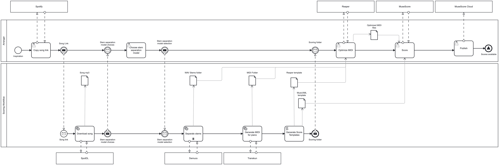

# Scoring Workflow
An AI based workflow to start scoring covers.

## Dependencies

- Python 3.8

## Installation

Please run `./install.sh` to install the required dependencies.

## Workflow



### Usage

1. Enter [Spotify](https://open.spotify.com) and find the song you want to score.
2. Right click on the song and select `Share`, then `Copy Link to Song`. This will copy the Spotify URI to your clipboard.
3. Then run `./scoring-workflow.sh $SPOTIFY_URI `
where `$SPOTIFY_URI`is the Spotify URI you copied in step 2.
4. The program will download the audio file of the song.
5. The program will ask you to choose a stem separation model, follow instructions.

### Output
The program will generate the following filesystem structure (using _Red Hot Chili Peppers - Parallel Universe_ as example):

```
red-hot-chili-peppers-parallel-universe
├── in
│   ├── red-hot-chili-peppers-parallel-universe-bass.wav
│   ├── red-hot-chili-peppers-parallel-universe-drums.wav
│   ├── red-hot-chili-peppers-parallel-universe-other.wav
│   ├── red-hot-chili-peppers-parallel-universe-vocals.wav
│   └── red-hot-chili-peppers-parallel-universe.mp3
├── out
└── src
    ├── red-hot-chili-peppers-parallel-universe-bass.mid
    ├── red-hot-chili-peppers-parallel-universe-drums.mid
    ├── red-hot-chili-peppers-parallel-universe-other.mid
    ├── red-hot-chili-peppers-parallel-universe-vocals.mid
    ├── red-hot-chili-peppers-parallel-universe.musicxml
    └── red-hot-chili-peppers-parallel-universe.RPP
```
Where:

* The `in` folder contains the downloaded audio file and the separated stems.
* The `src` folder contains the generated MIDI files, MusicXML file and Reaper file
* The `out` folder is empty and can be used to store the final scored files.

### Next steps
We suggest the following next steps to be taken after running the workflow:

1. Open the generated Reaper file in Reaper and check the generated MIDI files 
for each stem. Generated MIDI files may contain some errors, so you may need to 
edit them manually to correct any mistakes.
2. Export the corrected MIDI files.
3. Open MuseScore and import the generated MusicXML file, and save it as a 
MuseScore file, this will be you **main score**. You may need to correct the tempo, time signature and key 
signature.
3. Open the fixed MIDI files in MuseScore and copy and paste the notes into the main score. 
4. Keep editing the main score until you are satisfied with the result.
5. Generate the particellas for each instrument.
6. Export the final score as PDF and MIDI files.
7. Upload the final score the MuseScore Cloud.

### Usage example

```
./scoring-workflow.sh https://open.spotify.com/track/1Se0r96r0gnqg67kJPmESc?si=110b3b182e864379
```

## Known Issues
* The workflow downloads the song from YouTube and other sources, using the Spotify URI as reference only, which may not always be the correct version of the song. This can lead to incorrect scoring results.
* If there are multiple consecutive calls to the workflow, the IP address may get blocked by YouTube, and the workflow will fail. Try to use a VPN or wait for some time before trying again.
* At the moment, only piano MIDI is generated as we use _transkun_ to generate 
MIDI files. More solutions are being explored for the rest of the stems.
